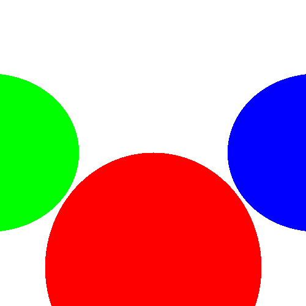

# Ray Meets Sphere

This repository contains a simple implementation of a ray tracing algorithm in Python. It generates a 3D-rendered scene with spheres and saves the output as an image.

## Prerequisites

To run this project, ensure you have Python 3 installed on your system along with the following libraries:

1. **NumPy**
2. **Pillow**

### Installing Dependencies

You can install the required dependencies using pip:

```bash
pip install numpy pillow
```

## How to Run

1. Clone this repository to your local machine:
   ```bash
   git clone https://github.com/Ali100i/RayMeetsSphere.git
   cd RayMeetsSphere
   ```

2. Run the script:
   ```bash
   python RayTracer.py
   ```

3. After running, the script will generate an image file named `raytraced_scene.png` in the same directory.

## Customization

You can modify the scene by editing the spheres defined in the `render_scene` function within the `RayTracer.py` file. Each sphere is defined by:

- **Center**: The position of the sphere in 3D space.
- **Radius**: The size of the sphere.
- **Color**: The RGB color of the sphere.

Example:
```python
spheres = [
    Sphere(Vector3(0, -1, 3), 1, (255, 0, 0)),  # Red sphere
    Sphere(Vector3(2, 0, 4), 1, (0, 0, 255)),  # Blue sphere
    Sphere(Vector3(-2, 0, 4), 1, (0, 255, 0))   # Green sphere
]
```

## Output

The program renders a simple scene with spheres and saves it as a PNG file. Here's an example of the expected output:



## License

This project is open-source

---

Feel free to contribute to this project by opening issues or submitting pull requests!
